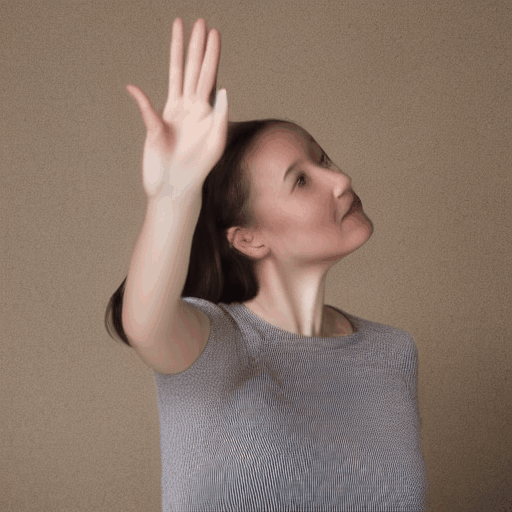

# Video Diffusion Experiments

Systematic investigation of temporal consistency in video diffusion models, with focus on understanding, measuring, and mitigating inter-frame flickering.

---

## Key Results

### Ablation Study Summary

| Intervention | Avg Improvement | Verdict |
|--------------|-----------------|---------|
| **Prompt engineering** | **+19.8%** | ✓ Most effective |
| Combined settings | +18.6% | ✓ Effective (prompt-driven) |
| More inference steps | +1.1% | ~ Negligible |
| Lower CFG | **-5.0%** | ✗ Made things worse |

**Bottom line:** Prompt engineering alone provides ~20% improvement in temporal consistency with zero computational overhead. Lower CFG, contrary to intuition, degrades consistency.

---

## Visual Comparison: Baseline vs Best

### woman_waving (+56.9% improvement)

| Baseline | Best (prompt_only) |
|----------|-------------------|
|  |  |
| Consistency: 21.80 | Consistency: 9.40 |

### portrait (+41.1% improvement)

| Baseline | Best (recommended) |
|----------|-------------------|
|  |  |
| Consistency: 10.02 | Consistency: 5.90 |

### mig21_missile (+18.7% improvement)

| Baseline | Best (prompt_only) |
|----------|-------------------|
|  |  |
| Consistency: 18.94 | Consistency: 15.39 |

### birds_flying (+12.6% improvement)

| Baseline | Best (prompt_only) |
|----------|-------------------|
|  |  |
| Consistency: 22.18 | Consistency: 19.38 |

---

## Recommended Configuration

Based on experimental evidence:

```python
# Configuration
config = {
    "guidance_scale": 7.5,        # Keep default (lower hurts!)
    "num_inference_steps": 25,    # Default is fine
    "num_frames": 16,
    "resolution": (512, 512),
}

# Universal prompt additions
positive_suffix = "smooth motion, consistent appearance, stable, coherent"

# Universal negative prompt
negative_prompt = (
    "flickering, morphing, jittery, inconsistent, unstable, "
    "changing shapes, bad quality, blurry, distorted"
)

# Content-specific additions to negative prompt
NEGATIVE_BY_CONTENT = {
    "human": "flickering hands, morphing fingers, distorted limbs",
    "object": "changing shapes, morphing objects, unstable edges", 
    "scene": "shaky camera, flickering textures, unstable background",
}
```

---

## Project Structure

```
video_diffusion_experiments/
├── docs/                           # Theory and analysis
│   ├── 01_diffusion_fundamentals.md    # DDPM → SDE → ODE → DDIM
│   ├── 02_video_diffusion_architecture.md  # AnimateDiff internals
│   ├── 03_understanding_architectures.md   # How to read model code
│   ├── 04_temporal_consistency_metrics.md  # Metric definitions
│   ├── 05_baseline_analysis_recommendations.md  # Initial analysis
│   └── 06_ablation_results_analysis.md     # Final results
├── experiments/                    # Runnable scripts
│   ├── 01_baseline_generation.py       # Generate test videos
│   ├── 02_architecture_inspection.py   # Analyze model structure
│   ├── 03_trace_forward_pass.py        # Hook-based tracing
│   ├── 04_measurement_pipeline.py      # Compute metrics
│   ├── 05_hyperparameter_ablation.py   # Generate ablation videos
│   └── 06_measure_ablations.py         # Measure all ablations
├── utils/                          # Shared utilities
│   └── forward_tracer.py               # PyTorch hook tracer
├── outputs/                        # Generated content (gitignored)
│   ├── 01_baseline/                    # Baseline videos
│   ├── 05_ablation/                    # Ablation experiments
│   └── 06_ablation_metrics/            # Measurement results
├── requirements.txt
└── README.md
```

---

## Setup

```bash
# Create environment
conda create -n video_diff python=3.10 -y
conda activate video_diff

# Install dependencies
pip install -r requirements.txt

# Optional: LPIPS for perceptual metrics
pip install lpips
```

### Hardware Requirements

Developed and tested on:
- NVIDIA GeForce RTX 3060 (12GB VRAM)
- 28GB system RAM
- CUDA 12.6

Minimum: 8GB VRAM (with VAE slicing enabled)

---

## Quick Start

### 1. Generate Baseline Videos
```bash
python experiments/01_baseline_generation.py
```

### 2. Measure Temporal Consistency
```bash
python experiments/04_measurement_pipeline.py --input outputs/01_baseline
```

### 3. Run Ablation Study
```bash
# Generate all ablation variants
python experiments/05_hyperparameter_ablation.py

# Measure all variants
python experiments/06_measure_ablations.py
```

---

## Findings Summary

### Why Flickering Occurs (Architectural Analysis)

AnimateDiff uses **per-position temporal attention**:

```
Spatial Attention:  [B×F, H×W, C]  → Each frame attends within itself
Temporal Attention: [B×H×W, F, C] → Each position attends across frames
```

**Critical limitation:** Position (5,10) in frame 1 can only see position (5,10) in other frames. It cannot see neighboring positions or track motion.

This causes flickering when:
- Objects move (position correspondence breaks)
- Multiple objects move differently (no global coordination)
- Fine textures need consistency (insufficient spatial context)

### What Helps (Experimental Evidence)

| Intervention | Why It Works/Fails |
|--------------|-------------------|
| **Prompt engineering ✓** | Model learned semantic associations with consistency terms |
| **Lower CFG ✗** | Removes stabilizing anchor; temporal attention alone insufficient |
| **More steps ~** | Content-dependent; static scenes benefit, dynamic scenes may not |

### Best Practices

1. **Always add consistency terms to prompts**
   - Positive: "smooth motion, consistent appearance"
   - Negative: "flickering, morphing, jittery"

2. **Keep CFG at default (7.5)**
   - Lower values destabilize generation

3. **Use content-specific negative prompts**
   - Humans: "flickering hands, morphing fingers"
   - Objects: "changing shapes, unstable edges"

---

## Metrics Reference

| Metric | What It Measures | Flickering Signature |
|--------|------------------|---------------------|
| MSE Mean | Frame-to-frame pixel difference | High = rapid changes |
| MSE Std | Consistency of changes | High = erratic changes |
| LPIPS | Perceptual difference | High = visual instability |
| Flow Variance | Motion consistency | High = incoherent motion |
| Consistency Score | Composite metric | Lower = better |

---

## Baseline Metrics

| Video | MSE Mean | LPIPS | Flow Var | Consistency |
|-------|----------|-------|----------|-------------|
| portrait | 0.0028 | 0.052 | 0.020 | 3.05 ✓ |
| landscape | 0.0072 | 0.071 | 0.002 | 4.72 ✓ |
| woman_waving | 0.0102 | 0.181 | 0.345 | 10.60 |
| mig21_missile | 0.0113 | 0.207 | 1.338 | 13.91 |
| corgi_beach | 0.0184 | 0.292 | 2.199 | 17.10 |
| birds_flying | 0.0211 | 0.380 | 0.317 | 22.80 ✗ |

Static scenes (portrait, landscape) perform well. Complex motion (birds, corgi) struggles.

---

## Ablation Details

### CFG Impact (Lower = Worse)

| Video | Baseline | CFG 5.0-6.5 | Change |
|-------|----------|-------------|--------|
| portrait | 10.02 | 11.07 | -10.4% |
| corgi_beach | 17.35 | 19.02 | -9.6% |
| mig21_missile | 18.94 | 19.84 | -4.8% |

### Prompt Impact (Consistent Improvement)

| Video | Baseline | +Prompts | Change |
|-------|----------|----------|--------|
| woman_waving | 21.80 | 9.40 | **+56.9%** |
| mig21_missile | 18.94 | 15.39 | +18.7% |
| portrait | 10.02 | 8.52 | +15.0% |

---

## Documentation

| Document | Description |
|----------|-------------|
| [Diffusion Fundamentals](docs/01_diffusion_fundamentals.md) | DDPM, SDE, DDIM theory |
| [Video Architecture](docs/02_video_diffusion_architecture.md) | AnimateDiff internals |
| [Reading Architectures](docs/03_understanding_architectures.md) | How to analyze models |
| [Metrics Guide](docs/04_temporal_consistency_metrics.md) | Metric definitions |
| [Baseline Analysis](docs/05_baseline_analysis_recommendations.md) | Initial observations |
| [Ablation Results](docs/06_ablation_results_analysis.md) | Final experimental findings |

---

## Future Work

### Not Yet Explored

1. **Post-processing approaches**
   - Optical flow-guided frame blending
   - Temporal filtering networks
   - Deflickering models

2. **Inference-time modifications**
   - Cross-frame attention injection
   - Latent blending between frames
   - Progressive CFG scheduling

3. **Architectural modifications**
   - Stronger temporal attention weights
   - Global motion tokens
   - Flow-conditioned generation

---

## References

### Papers
- [AnimateDiff](https://arxiv.org/abs/2307.04725) — Guo et al., 2023
- [DDPM](https://arxiv.org/abs/2006.11239) — Ho et al., 2020
- [DDIM](https://arxiv.org/abs/2010.02502) — Song et al., 2020
- [Score-Based SDE](https://arxiv.org/abs/2011.13456) — Song et al., 2021
- [LPIPS](https://arxiv.org/abs/1801.03924) — Zhang et al., 2018

### Code
- [diffusers](https://github.com/huggingface/diffusers) — Hugging Face
- [AnimateDiff](https://github.com/guoyww/AnimateDiff) — Original implementation

---

## License

MIT

---

*Last updated: December 2024*
