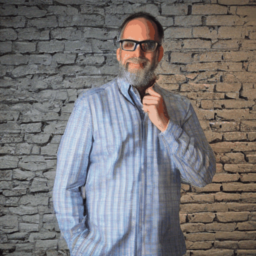

# AnimateDiff Temporal Consistency Research

Systematic study of hyperparameter effects on temporal consistency in AnimateDiff video generation.

**Collaboration:** Deccan AI  
**Status:** Grid Search Ablation Complete ✓

---

## Key Findings (TL;DR)

Our initial hypotheses were **wrong**. Data-driven results:

| Parameter | Expected | Actual Finding |
|-----------|----------|----------------|
| CFG Scale | Lower is better | **Higher (9.0) is better** |
| Inference Steps | More is better | **Fewer (15) is better** |
| Enhanced Prompts | Always help | **Content-dependent** |

---

## Visual Evidence

### Higher CFG = Better Temporal Consistency

| CFG 5.0 (Worse) | CFG 9.0 (Better) |
|-----------------|------------------|
|  |  |

### Fewer Steps = Less Frame Drift

| Steps 50 (Worse) | Steps 15 (Better) |
|------------------|-------------------|
|  |  |

### Prompt Engineering: Content-Dependent

| Content Type | Baseline | Enhanced | Effect |
|--------------|----------|----------|--------|
| Woman Waving |  |  | ✓ HELPS |
| Portrait |  |  | ✗ HURTS |

---

## Recommendations

| Content Type | CFG | Steps | Enhanced Prompts |
|--------------|-----|-------|------------------|
| Static scenes (portrait, landscape) | 9.0 | 15-25 | ❌ Don't use |
| Natural motion (birds, dogs, waving) | 9.0 | 15-20 | ✅ Use |
| Fast action (jets, explosions) | 7.0-7.5 | 20-30 | ❌ Don't use |

---

## Repository Structure

```
├── experiments/
│   ├── 01_baseline_generation.py       # Initial baseline
│   ├── 02_architecture_inspection.py   # Model inspection
│   ├── 03_measurement_pipeline.py      # Core metrics
│   ├── 05_grid_search_ablation.py      # Generate grid search videos
│   ├── 06_measure_grid_search.py       # Compute temporal metrics
│   ├── 07_analyze_grid_search.py       # Basic analysis
│   └── 08_analyze_comprehensive.py     # Full multi-metric analysis
│
├── outputs/
│   ├── 05_grid_search/                 # Generated videos (78 experiments)
│   ├── 06_grid_search_metrics/         # Metric JSON files
│   ├── 07_grid_search_analysis/        # Analysis CSVs
│   └── 08_comprehensive_analysis/      # Detailed analysis CSVs
│
├── docs/                               # Theory and learning notes
│   ├── 01_diffusion_fundamentals.md
│   ├── 02_video_diffusion_architecture.md
│   └── 03_temporal_consistency.md
│   └── GRID_SEARCH_ANALYSIS_REPORT.md  # Full technical report
│
├── assets/                             # Demo GIFs for documentation
│
└── scripts/
    └── copy_demo_gifs.py               # Copy GIFs to assets folder
```

---

## Metrics Used

| Metric | What It Measures |
|--------|------------------|
| MSE | Pixel-level frame difference |
| LPIPS | Perceptual difference (AlexNet) |
| Flow Magnitude | Amount of motion (px/frame) |
| Flow Variance | Motion consistency |
| Warp Error | Motion prediction error |
| Flicker Index | Second-order temporal oscillation |

All metrics: **lower is better** for temporal consistency.

---

## Quick Start

### 1. Setup Environment

```bash
conda create -n video_diff python=3.10 -y
conda activate video_diff
pip install -r requirements.txt
```

### 2. Run Grid Search (~2-3 hours)

```bash
python experiments/05_grid_search_ablation.py
```

### 3. Measure Results

```bash
python experiments/06_measure_grid_search.py
```

### 4. Analyze

```bash
python experiments/07_analyze_grid_search.py
python experiments/08_analyze_comprehensive.py
```

---

## Branches

| Branch | Description |
|--------|-------------|
| `main` | Stable baseline |
| `arbitrary-ablations` | Initial heuristic experiments (30 experiments) |
| `grid-search-ablations` | Systematic grid search (78 experiments) |

---

## Key Results Summary

### CFG Sweep (Steps=25)

CFG 9.0 wins **7 out of 8 metrics** across 6 test videos.

```
CFG wins by metric:
  MSE:           CFG 9.0 wins 4/6 videos
  LPIPS:         CFG 9.0 wins 5/6 videos
  Warp Variance: CFG 9.0 wins 6/6 videos ✓✓✓
  Flicker Index: CFG 9.0 wins 5/6 videos
```

### Steps Sweep (CFG=7.5)

Steps 15 wins **all 8 metrics**.

```
Steps wins by metric:
  MSE:           Steps 15 wins 3/6 videos
  Warp Variance: Steps 15 wins 4/6 videos
  Flicker Index: Steps 15 wins 4/6 videos
```

### Prompt Engineering

```
Per-Video Results:
  birds_flying     +42.1% MSE improvement  ✓ HELPS
  corgi_beach      +28.0% MSE improvement  ✓ HELPS
  woman_waving     +45.8% MSE improvement  ✓ HELPS
  landscape         -0.6% (neutral)        ~ NEUTRAL
  mig21_missile    -83.1% MSE (worse!)     ✗ HURTS
  portrait        -167.9% MSE (worse!)     ✗ HURTS
```

---

## Detailed Report

See [docs/GRID_SEARCH_ANALYSIS_REPORT.md](docs/GRID_SEARCH_ANALYSIS_REPORT.md) for:
- Full methodology
- All data tables
- Per-video breakdowns
- Metric agreement analysis

---

## Hardware

- GPU: NVIDIA RTX 3060 12GB
- RAM: 28GB system
- CUDA: 12.6 driver
- Generation time: ~2 minutes per video (16 frames, 512x512)

---

## Learning Log

### Phase 1: Foundations ✓
- [x] Environment setup
- [x] Baseline video generation with AnimateDiff
- [x] Architecture inspection
- [x] Measurement pipeline (MSE, LPIPS, Flow, Warp Error, Flicker)

### Phase 2: Ablation Studies ✓
- [x] Initial arbitrary ablations (30 experiments)
- [x] Systematic grid search (78 experiments)
- [x] Multi-metric analysis
- [x] Content-type recommendations

### Phase 3: Future Work
- [ ] Automated content classification
- [ ] Adaptive parameter selection
- [ ] Test on additional models

---

## References

- [AnimateDiff Paper](https://arxiv.org/abs/2307.04725)
- [DDIM Paper](https://arxiv.org/abs/2010.02502)
- [LPIPS Paper](https://arxiv.org/abs/1801.03924)
- [Optical Flow (Farneback)](https://docs.opencv.org/4.x/d4/dee/tutorial_optical_flow.html)

---

## License

Research project for Deccan AI collaboration.
